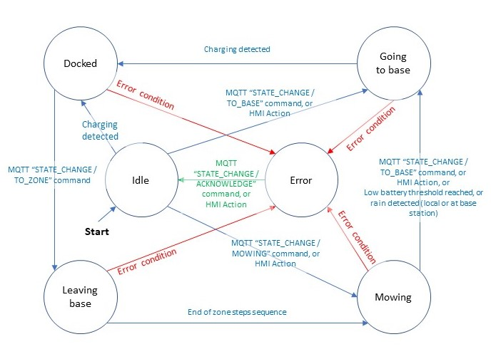

# Automower

[](https://github.com/Mrgove10/AutoMower/actions/workflows/mower.yml)
[](https://github.com/Mrgove10/AutoMower/actions/workflows/webapp.yml)
[](https://www.codefactor.io/repository/github/mrgove10/automower)

**Note: This project is a work in progress !!**

## Table of contents

- [Automower](#automower)
  - [Table of contents](#table-of-contents)
  - [The AutoMower project](#the-automower-project)
    - [Background](#background)
    - [Mower and docking base](#mower-and-docking-base)
    - [Perimeter signal sending box](#perimeter-signal-sending-box)
    - [Hardware components](#hardware-components)
    - [Hardware architecture](#hardware-architecture)
    - [Communications architecture](#communications-architecture)
    - [Software Environment](#software-environment)
    - [Mower and perimeter signal sender program architecture](#mower-and-perimeter-signal-sender-program-architecture)
    - [Mower tasks](#mower-tasks)
      - [FastAnaReadTsk](#fastanareadtsk)
      - [PerimProsTsk](#perimprostsk)
      - [AnaReadTsk](#anareadtsk)
      - [SonarReadTsk](#sonarreadtsk)
      - [Main task](#main-task)
    - [Base Station tasks](#base-station-tasks)
      - [PerimSendTsk](#perimsendtsk)
      - [Main task](#main-task-1)
  - [Mower communications](#mower-communications)
    - [Sending Commands and values to the Mower](#sending-commands-and-values-to-the-mower)
      - [AutoMower/Command topic](#automowercommand-topic)
        - [Mower State changes](#mower-state-changes)
        - [Calibration](#calibration)
        - [Reset charge duration](#reset-charge-duration)
        - [Reset partial mowing time](#reset-partial-mowing-time)
        - [Over The Air program update (OTA)](#over-the-air-program-update-ota)
        - [ESP restart](#esp-restart)
        - [Change Trace Level](#change-trace-level)
        - [Parameter value change](#parameter-value-change)
        - [Test & Debug commands](#test--debug-commands)
          - [Stop/activate sending of raw perimeter signal read task](#stopactivate-sending-of-raw-perimeter-signal-read-task)
          - [Stop/activate sending of processed perimeter code detection task](#stopactivate-sending-of-processed-perimeter-code-detection-task)
          - [Stop/activate sending of perimeter wire tracking control](#stopactivate-sending-of-perimeter-wire-tracking-control)
          - [detailed](#detailed)
          - [Forward mower test move](#forward-mower-test-move)
          - [Reverse mower test move](#reverse-mower-test-move)
          - [Turn mower test move](#turn-mower-test-move)
          - [Motion motor Test](#motion-motor-test)
          - [Cutting motor Test](#cutting-motor-test)
          - [TEST_STOP](#test_stop)
          - [Test](#test)
    - [Receiving information from the Mower](#receiving-information-from-the-mower)
      - [AutoMower/Telemetry topic](#automowertelemetry-topic)
      - [AutoMower/Log topic](#automowerlog-topic)
  - [Base station communications](#base-station-communications)
    - [Sending Commands and values to the Base station](#sending-commands-and-values-to-the-base-station)
      - [Automower/Base/Command](#automowerbasecommand)
        - [Base station State changes](#base-station-state-changes)
        - [Reset rain duration](#reset-rain-duration)
        - [Over The Air program update (OTA)](#over-the-air-program-update-ota-1)
        - [ESP restart](#esp-restart-1)
        - [Change Trace Level](#change-trace-level-1)
        - [Parameter value change](#parameter-value-change-1)
        - [Test & Debug commands](#test--debug-commands-1)
          - [Stop/activate sending of perimeter signal (without changing base station state)](#stopactivate-sending-of-perimeter-signal-without-changing-base-station-state)
          - [Run startup Tests](#run-startup-tests)
    - [Receiving information from the base station](#receiving-information-from-the-base-station)
      - [AutoMower/Base/Telemetry topic](#automowerbasetelemetry-topic)
      - [AutoMower/Log topic](#automowerlog-topic-1)
      - [AutoMower/Base/Perimeter topic](#automowerbaseperimeter-topic)
      - [AutoMower/Base/Rain topic](#automowerbaserain-topic)
  - [Website](#website)
  - [License](#license)
  - [Contribution](#contribution)

---

## The AutoMower project

### Background

After looking around for an autonomous mower and being put off by the cost of commercial brands and models, I was suggested to consider the DIY option.

Following some ploughing through numerous open source mower projects that can be found over the internet, I opted for the REP_AL 3D printed robotic lawn mower (<https://repalmakershop.com/pages/little-monster-project-overview>).

The REP_AL project is a mix between an open-source approach (the software and the 3D printed parts .STL files are available online for free) and a commercial approach as you can, if you wish, purchase the original CAD files as well as the parts (3D printed or other components such as motors, sensors ...). The project and product appeared to be reasonably well documented, offered different mower sizes and the design felt as "manageable" for a hobbyist and, last but not least, it seemed to deliver an operational mower !

I opted for an "hybrid" approach as I decided to purchase the CAD file pack, so I could perform some modifications more easily, and I would print my own parts and purchase the other components directly from AliExpress. In hind site, buying the CAD files was the right thing to do as it enabled me to perform quite a few changes to the design, such as integrating a different control hardware architecture (see below).

### Mower and docking base

Considering the size of my lawn (~ 400 m2) and the size of the 3D printer needed, I decided to build the Monster 220 model (<https://repalmakershop.com/pages/220-monster-project-overview>).

It has a length of 470mm, a width of 380 mm and a hight of 220 mm. The disk supporting the (standard commercial) cutting blades has a diameter of 180 mm, which provides a cutting width of ~200 mm in total.

Basically, the REP_AL design is based on a mower with two rear traction wheels and two front caster wheels. The mower mainly senses it's environment through ultrasonic sensors, a perimeter wire sensor and a set of front bumpers.

The REP_AL design also comes with a 3D printer docking base which is used to recharge the mower. The docking base is placed on the perimeter wire and the charging pods are positioned on the front of the mower.

Overall, including the docking station and perimeter signal sending box, the number of individual printed pieces is around 100, using a total of 5.5 kg of PLA (including approximately 5% of material loss due to printed fails). Approximately 325 printing hours where required (including failed parts).

### Perimeter signal sending box

The mowing zone is delimited using a perimeter wire through which a perimeter signal is send by a fixed sending box which includes a dedicated set of components to generate the perimeter signal.

The perimeter sender outputs a digital code sequence (a 'pseudo-noise' code), and the receiver (mower) detects that code using a software-based digital matched filter. Depending on whether the match result peak is positive or negative, the mower knowns if it is inside or outside of the perimeter wire.

The perimeter signal design used in the REP_AL project is a fork of the one used in the Ardumower project (<https://www.ardumower.de/en/home.html>). Details can be found here: <https://wiki.ardumower.de/index.php?title=Perimeter_sender_(English)>

### Hardware components

In addition to the 3D printed parts used to build the structure of the mower, the following components are used:

- Other mower body components:

  - 2 x 8" scooter type tires *(a change from the original 3D printed wheels)*
  - 2 x pivoting caster wheels *(a change from the original 3D printed wheels)*
  - 1 x 180 mm bicycle breaks disk, used as a cutting disk *(a change from the original 3D printed blade supporting disk)*
  - 1 x Rigid flange coupling to join the cutting blade and the cutting motor axle *(a change from the original design)*
  - 2 x aluminium rod/tube used as an axle between the traction motors shaft and the traction wheels
  - 2 x Rigid shaft coupler to join the axles to the traction motors *(a change from the original design)*
  - 2 x bearings to support the axle between the traction motors shaft and the traction wheels
  - 2 x Rigid flange coupling to join the axle to the traction wheels *(a change from the original design)*
  - 1 x set of standard cutting blades

- 12V electrical circuit:

  - Mower:
    - 1 x 12.6V LI-Ion battery (3S6P) with 18 x 18650 cells and a BMS
    - 4 x automotive-type fuses *(an addition to the original design)*
    - 1 x E-Stop switch, with a latch, to isolate whole mower from battery *(a change from the original design)*
    - 1 x 12-24V relay, to control battery charging circuit
    - 1 x 12V to 5V DC-DC adjustable step down buck converter

  - Base station:

    - 1 x 5 A 12V power supply unit (adjustable to 12.6V)
    - 2 x 12V to 5V DC-DC adjustable step down buck converters

- Actuators and displays:

  - Mower:

    - 2 x 30 RPM 12V traction motors
    - 2 x L298N traction motor drivers
    - 1 x 3000 RPM 12V cutting disc motor
    - 1 x IBT-2 cutting disc motor driver
    - 2 x 5V 40 mm fans
    - 2 x IRLZ44 logic level power mosfet, to drive the fans
    - 1 x 2004 LCD screen (4x20 characters) *(a simplification from the original color touch-screen design)*
    - 1 x buzzer *(an addition to the original design)*

  - Base station:

    - 1 x L298N motor driver driving the perimeter
    - 1 x 5V 40 mm fan
    - 1 x IRLZ44 logic level power mosfet (to drive the fan)
    - 1 x SSD1306 Oled display (128 x 64 pixels) *(an addition to the original design)*

- Sensors:

  - Mower:

    - 3 x HC-SR04 ultra-sonic distance sensors
    - 2 x microswitches for front bumper collision detection
    - 4 x INA219 current measurement sensors for traction and cutting motors and for battery charging *(a change/addition from the original design)*
    - 1 x LM386 operational amplifier, used to sense the perimeter wire signal
    - 1 x Ferrite coil, used to sense the perimeter wire signal
    - 2 x DS18B20 waterproof temperature sensor *(an addition to the original design)*
    - 1 x MPU6050 6 axes gyroscope and accelerometer
    - 2 x Ball Switch Tilt Sensor Modules, to stop mower if tilt angle is too high
      1 x HMC5883 magnetometer (optional)
    - 1 x capacitive rain detection sensor
    - 1 x 4 key keypad *(a simplification from the original color touch-screen design)*
    - 1 x GPS module *(Optional, an addition to the original design)*

  - Base station:

    - 1 x INA219 current measurement sensors for perimeter wire *(a change to the original design)*
    - 1 x DS18B20 waterproof temperature sensor *(an addition to the original design)*
    - 1 x capacitive rain detection sensor *(an addition to the original design)*
    - 1 x 4 key keypad *(an addition to the original design)*

- Control:

  - Mower:

    - 1 x ESP32-VROOM Expressif micro-controller development board *(a change from the original design)*
    - 1 x Custom-designed PCB to host the ESP32 and provide the necessary connectivity with the the sensors, displays and actuators. The PCB also includes a MCP23017 I2C 16-Bit I/O Expander module

  - Base station:

    - 1 x ESP32-VROOM Expressif micro-controller development board *(a change from the original design)*
    - 1 x Custom-designed PCB to host the ESP32 and provide the necessary connectivity with the the sensors, displays and actuators. For sake of simplicity and consistency, the PCB used for the perimeter sending station is the same as the one used in the mower.

- Miscellaneous:

  - 1 set of nuts of bolts (lots of them !)
  - 1 Perimeter wire
  - Epoxy and hot glue
  - 2 springs for base station 12V charging pods

- Infrastructure:
  - Wifi network
  - Server (hosted on a Raspberry Pi 4 or equivalent) - See Software architecture section below

### Hardware architecture

The hardware architecture and most of the hardware components used are based on, or inspired from, the original REP_AL design.

We however, decided to make some fairly radical changes from the original design, especially regarding the controller architecture used.

The original design is based on a combination of multiple controllers of different types (Arduino MEGA 2560, Arduino Uno, Arduino Nano, ESP8266) with specialised functions and communicating with one another. It is apparent the this is the result of both a number of iterations in the design (with the addition of new features and devices along the way) and the hardware available when the project started.

We considered that the end-result to appear rather complicated and decided that we would start with a blank page. We estimated that all the functions of either the mower or the perimeter sending box could each be hosted and performed in one controller only, thus simplifying significantly the architecture, while reducing it's cost. For this purpose, we selected the Expressif ESP32 as the MCU.

Considering the number of I/O needed and the GPIO effectively available (and useable) on ESP32 development boards, we added an I2C GPIO expansion module, which was included to the custom-build PCB design.

In summary, the PCB hosts:

- the ESP32
- a 12V to 5V step-down converter
- the I2C GPIO extension module (MCP23017)
- a set of 3.3v, 5V and 12V connection points (through screw terminal blocs)
- all the connection points for the wires connecting the different components. The connection are realised using JST type connectors. The connection points are:

  - Direct GPIO connections to ESP32:
    - the LM386 operational amplifier, used to sense the perimeter wire signal (mower)
    - the traction and cut motor PWM speed control signals (mower) or the perimeter wire power control (base station)
    - the front bumper switches (mower)
    - the fans (mower & base station)
    - the ultra-sonic sonar sensors (mower)
    - the tilt sensors (mower)
    - the temperature sensors (mower & base station)
    - the rain sensor (mower & base station)
    - the buzzer (mower)

  - GPIO connections to I2C GPIO extension module:
    - the traction motor direction and enable signals (mower)
    - the cutting motor direction and enable signals (mower)
    - the perimeter signal motor direction and enable signals (base station)
    - the fans (mower & base station)
    - the keypad (mower & base station)
    - the battery relay (mower)

  - I2C connections:
    - the display (mower & base station)
    - the Gyroscope/accelerometer (mower)
    - the magnetometer/compass (mower)
    - the INA219 current sensor modules (mower & base station)

  - UART connections:
    - the GPS module (mower)

### Communications architecture

Considering my lawn's environment (position of base station and house relative to the garden), the decision was made to handle all communications to/from the mower and the base station through WiFi. This is very fortunate and enables to take full benefit of the possibilities of such connexion, namely:

- use of MQTT protocol to send commands, receive feedback and telemetry from the mower and base station, enable mower <=> base station communications
- use of wireless Telnet to send trace and debug messages, instead of having to connect a serial cable. For obvious reasons, this is an **absolute MUST HAVE**
- enable the use of OTA program downloads to the mower and the base station controllers. Considering the number of updates needed during the development and testing phase, this turned out to be an **absolute MUST HAVE**.

No Bluetooth, GSM or radio communications are used.

### Software Environment

In terms of software environment, the overall system is based on the following components:

- The ESP32 programs (one for the mower and one for the base station) are implemented in C++ using the Platform.IO development environment
- A number of C++ libraries
- A Mosquito MQTT broker/server to provide MQTT messaging capabilities (hosted on a Raspberry Pi 4)
- A Node-Red server (hosted on a Raspberry Pi 4). Node-Red is used to:
  - provide a mower control dashboard, which can be used with a standard internet browser
  - data management, mainly the formatting and storing of the telemetry data in the database server
- A MySQL Database server (hosted on a Raspberry Pi 4), used to store the telemetry and logs
- the Grafana extraction and visualisation tool (hosted on a Raspberry Pi 4), access through a standard internet browser.

As a direct result of the different options taken (ESP32 and Wifi, mainly) the mower and base station programs had to entirely re-written. The perimeter signal coding and decoding (digital matched filter) have been adapted from the REP_AL code as well from the original Ardumower code. All the other functions have been defined and developed "from scratch".

### Mower and perimeter signal sender program architecture

As a reminder, the ESP32 is based on a dual core processor and offers a Free RTOS multi-tasking operating system.

As per "out of the box" standard practice when programming an ESP32, one of the two cores (core 0) are used for the Wifi communications tasks and all the application tasks run on the second core (core 1).

The breakdown of the mower and perimeter sending applications into different RTOS tasks has been driven by the following considerations and requirements:

- the need to perform very high-frequency tasks, independently of other applications tasks. This is specifically required to send the perimeter signal/code (by base station at ~ 9 kHz) or to sense and decode the perimeter signal/code (by mower at ~ 40 kHz).
- the coding simplifications enabled by separating out into distinct tasks on-going functions
- the benefits (re-usability, maintainability) of structuring the mower and base-station programs in a consistent manner.

To exchange data between the different tasks, the following mechanisms are used:

- Global variables - Yes, I know, using global variables is considered as a *POOR* programming practice: to mitigate some of the risks of using global variables, they are prefixed in the code using **'g_'**
- Queues
- Semaphores

All tasks run at the same (default) priority level of 1.

### Mower tasks

The mower application is broken down into the following RTOS tasks:

- Perimeter signal acquisition task (FastAnaReadTsk)
- Perimeter signal processing task (PerimProwTsk)
- Ultra-sonic acquisition task (SonarReadTsk)
- Analog value read task (AnaReadTsk)
- Main task (default task)

#### FastAnaReadTsk

This is probably the most complex part of the whole project.

As mentioned before, the perimeter signal is based on a digital code sequence (a 'pseudo-noise' code).

In practice, the sender sends a 1 or 0 or -1 at 9 kHz (the pulse is therefore 104 microseconds long) and the mower sensing function reads the signal at ~38 kHz (4 times faster) and aims to capture 4 values for each "pulse" sent by the sender. This means that each sample has to be read every 26 microseconds

So the essence here is to be able to acquire at (very) high frequency analog values (sensed by the Ferrite coil and amplified by the LM386 operational amplifier).

Although the ESP32 is quite fast - Its cpu frequency reaches 240 Mhz - compared to an Arduino Uno or Mega, it is not possible to achieve such sampling rate using the usual "analogRead" function. The only solution found (not saying that there is no other way, just that I did not find it) was to use the ESP32 in-build I2S driver. I²S (Inter-IC Sound), is an electrical serial bus interface standard used for connecting digital audio devices together.

The ESP32 environment enables to map the I2S driver to the controllers ADC (Analog to Digital Converter) and set a high speed acquisition sampling rate and set signal the resolution (12 bit ADC resolution used here). The I2S driver places the acquired values in a DMA buffer and signals that data is available for processing through an RTOS queue.

In summary, the FastAnaReadTsk task:

- on task's launch:
  - Initialises the I2S driver and set the sampling rate (38 400 kHz) and notification queue
  - Initialises the ADC for use by the I2S driver
  - Initialises the dma buffers (4 buffers used for safety, just in case the task is slowed down)

- as an endless loop:
  - waits for a message on the notification queue
  - when a message is received (data is ready to be read), reads the DMA buffer and stores the raw acquired values into a shared (global variable) circular buffer (array)

To reduce the risk of being too slow and of loosing data, this is all this task does. The processing of the signal is performed by another task (PerimProcTsk)

#### PerimProsTsk

This task processes the raw perimeter signal analog values and determines if the mower is inside or outside the perimeter. It also determines the strength of the signal to establish if the mower signal is received or not.

In summary, the PerimProcTsk task:

- on task's launch:
  - Initialises one of the ESP32 hardware timer used to trigger an ISR (Interrupt Software Routine) that will notify the task to process raw perimeter data. The timer is set to 100 milliseconds
  - enables the timer

- as an endless loop:
  - waits for a notification from the timer ISR through an RTOS notification mechanism (less resource intensive than using a semaphore or a queue)
  - when a notification is received (time to process data):

    - reads the raw perimeter signal data from the circular buffer written by the FastAnaReadTsk task
    - corrects the raw data using calibration data
    - converts the calibrated values into a fixed [-127,+127] range (pas per original Ardumower/REP_AL code)
    - applies the digital match filter onto the converted values
    - makes summary data (typically mower in or out of perimeter) available to other mower functions, through global variables

#### AnaReadTsk

For the main program, having *"permanently"* up to date sensor values make the program easier to read (and to code !).

For this reason, most of analog value acquisitions have been grouped into a "slower" analog value read task.

In summary, the AnaReadTsk task:

- on task's launch:
  - Initialises the necessary sensors

- as an endless loop:
  - Calls the battery voltage read function
  - Calls the battery charge check function
  - Calls the motion motors current read function
  - Calls the cutting motor current read function
  - Calls the GPS position read function
  - Calls the gyroscope/accelerometer read function that determines the mower's pitch and roll
  - Calls the compass read function

Each of the called functions above determine whether a read should actually be performed or not base on the last acquisition time and the acquisition interval set for each value.

The values are made available to other mower functions, through global variables.

Some of the analog value acquired by this task are by using "standard" analogRead function and the underlying ADC.

In practice, if no precautions are taken, the use of the ADC by the I2S Driver (see FastAnaReadTsk task), interferes with the standard analogRead function. To solve this problem, a MUTEX semaphore is implemented to ensure that the ADC is not used while the I2S driver is using it (and vice-versa).

Similarly, some readings come from I2C devices typically the current measurements comming from the INA219 modules. As this task runs independently and asynchronously from other functions also using the I2C bus (e.g. the sending of data to the displays), the use of the I2C bus is protected by the use of another MUTEX semaphore.

#### SonarReadTsk

Although the ultra-sonic sonar readings could have been handled through the AnaReadTsk task, a dedicated task is implemented for these readings. In hind site, I'm not quite sure why it is done in this way, this was a good option as it turns out that, for unknown reasons, this task hangs, from time to time. To limit the effects of such spurious hangs, the tasks increments a loop counter that is monitored by the main task and if the counter stops incrementing, the main task restarts the SonarReadTsk task.

In summary, the SonarReadTsk task:

- on task's launch, initialises the sonar I/O
- as an endless loop, calls the sonar distance measurement calculation function

The sonar distances are made available to other mower functions, through global variables.

#### Main task

The main, default, task performs all the other mower functions, which are, in summary:

- Mower setup sequence, consisting of:

  - Initialisation of RTOS semaphores
  - The setup of a idle CPU counting hook (to have level of visibility on the free time each CPU has and of the actual load of the ESP32)
  - Initialisation of the display
  - Initialisation of I2C I/O extension module
  - Initialisation of motion and cutting motors
  - Initialisation of buzzer
  - Initialisation of motor current sensors
  - Initialisation of compass
  - Initialisation of battery charge relay
  - Initialisation of keypad
  - Initialisation of telnet interface (used to send "serial.print" commands to a terminal connected over telnet)
  - Initialisation of values stored in EEPROM
  - Initialisation of Wifi and connection to house access point
  - If an OTA update has been requested, enter OTA update mode
  - Initialisation of date and time through NTP protocol
  - Initialisation of MQTT stack and subscription to relevant MQTT channels
  - Initialisation of battery charging current sensor
  - Initialisation of temperature sensors
  - Initialisation of fans
  - Initialisation of motion and cutting motors **(Second time ???? TO BO CHECKED)**
  - Initialisation of compass **(Second time ???? TO BO CHECKED)**
  - Initialisation of bumpers (bumper I/O are monitored using hardware interrupts)
  - Initialisation of tilt sensors (Tilt sensors I/O are monitored using hardware interrupts)
  - Initialisation of GPS
  - Initialisation of Gyroscope/accelerometer
  - Initialisation of SonarReadTsk task
  - Initialisation of FastAnaReadTsk task
  - Initialisation of AnaReadTsk task
  - Initialisation of PerimProcTsk task
  - Initialisation of mowing zone definitions
  - The execution of startup checks

- Mower endless loop, consisting of:

  - Temperature reading and fan start/stop
  - Management of the mower states, in a state machine mode
  - Calling the EEPROM update function
  - Calling the MQTT status check and reconnection function
  - Calling the MQTT telemetry send function
  - Calling the display dimming function (to reduce energy consumption and limit screen burn-out)
  - Call all library refresh functions (MQTT, Telnet, NTP time update ...)

The different mower states and main transitions are summarized as follows:



**NOTE:** The library used to send over telnet the trace and debugging messages was not designed to be used in a multi-task environment. As done for the I2C bus, the use of this telnet library is protected using an RTOS MUTEX semaphore.

### Base Station tasks

The base station application is broken down into the following RTOS tasks:

- Perimeter signal sending task (PerimSendTsk)
- Main task (default task)

#### PerimSendTsk

As mentioned before, the perimeter signal is based on a digital code sequence (a 'pseudo-noise' code).

In practice, the sender sends a 1 or 0 or -1 at 9 kHz : the pulse is therefore 104 microseconds long. So the essence here is to be precise and systematic in sending the signal at the defined rate.

In order to achieve a precise and controlled regularity, the task is "woken-up" through a hardware timer triggered ISR that writes a notification message into an RTOS queue on which the task is waiting.

***NOTE:** This could also have been achieved by using an RTOS notification mechanism, in the same way it has been done for the mower PerimProcTsk task. Originally, the two tasks used the same queue-based mechanism, but on the mower side, the processor having much more work to do than in the sender application, the queue created some problems (some orders where missed) and lead to using the RTOS notification method.*

In summary, the PerimSendTsk task:

- on task's launch:
  - Initialises one of the ESP32 hardware timer used to trigger an ISR (Interrupt Software Routine) that will notify the task to send the next bit in the digital code sequence. The timer is set to 104 microseconds
  - enables the timer

- as an endless loop:
  - waits for a notification from the timer ISR through the RTOS queue
  - when a notification is received (time to send next code bit), sets the digital outputs driving the L298N motor driver to either send a "Forward" or "Reverse" or "Stop" on the perimeter line.

As the perimeter wire is fed through a motor driver, the power (amplitude) of the signal can the adjusted using the PWM input to the motor driver.

#### Main task

The main, default, task performs all the other base station functions, which are, in summary:

- base station setup sequence, consisting of:
  - Initialisation of RTOS semaphores
  - The setup of a idle CPU counting hook (to have level of visibility on the free time each CPU has and of the actual load of the ESP32)
  - Initialisation of the display
  - Initialisation of I2C I/O extension module
  - Initialisation of keypad
  - Initialisation of telnet interface (used to send "serial.print" commands to a terminal connected through telnet)
  - Initialisation of values stored in EEPROM
  - Initialisation of Wifi and connection to house access point
  - Initialisation of OTA update related functions
  - Initialisation of date and time through NTP protocol
  - Initialisation of MQTT stack and subscription to relevant MQTT channels
  - Initialisation of perimeter wire load current sensor
  - Initialisation of temperature sensors
  - Initialisation of fans
  - Initialisation of PerimSendTsk task
  - The execution of startup checks

- base station endless loop, consisting of:
  - Management of the base station states, in a state machine mode
  - Temperature reading and fan start/stop
  - Calling the EEPROM update function
  - Calling the MQTT status check and reconnection function
  - Calling the MQTT telemetry send function
  - Calling the mower status check function
  - Calling the display dimming function (to reduce energy consumption and limit screen burn-out)
  - Call all library refresh functions (MQTT, Telnet, NTP time update ...)

Similarly to the mower application, the use of the I2C bus is protected by the use of a MUTEX semaphore (probably not strictly needed in the base station application, but this enabled to re-use the same code as the mower). A telnet library protection MUTEX semaphore is also used.

The different base station states and main transitions are summarized as follows:


State changes are mainly done through the reception of commands from the Mower through MQTT messages or through user inputs on the keypad.

---

## Mower communications

### Sending Commands and values to the Mower

Communication is done through MQTT, and the following topics are used:

#### AutoMower/Command topic

 The messages in this topic are in JSON format and should follow this structure:

```json
{
  "Command":"<Command>",
  "Val1":"<Command_Dependant_String_1>",
  "Val2":"<Command_Dependant_String_2>"
}
```

The list of Commands and their expected associated values are as describes below:

##### Mower State changes

**Description** : This command is used to put the mower in a given state.

In this state the mower is doing nothing and waits for the next command.

**Command** : `STATE_CHANGE`

**Val1** : Possible values for Val1 are:

- `IDLE` : In this state the mower is doing nothing and waits for the next command.

- `DOCKED` : In this state the mower is docked.

- `MOWING` : In this state the mower is doing it's primary work....mowing the lawn !

- `TO_BASE` : In this state the mower is returning to its base/charging station.

- `FROM_BASE` : In this state the mower is leaving its base/charging station and going to the mowing zone.

- `ERROR` : This is the state when the Mower has identified an error condition and is stopped and waiting for an acknowledgement from the user. This command is not for operational use and only for testing purposes.

- `ACKNOWLEDGE` : This is the command to acknowledge an error. Upon acknowledgement, the mower will return to `IDLE` state. Acknowledgement can also be performed directly on the mower's HMI.

- `TEST` : This is the command to trigger the mower's startup test sequence. At the end, the mower will return to `IDLE` state.

**Val2** :

- For `MOWING` state, possible values for Val2 are:
  - `0` for Random mowing.
  - `1` for spiral mowing clockwise 
  - `2` for spiral mowing counter clockwise
  - `3` for perimeter mowing clockwise
  - `4` for perimeter mowing counter clockwise

- For `FROM_BASE` state, Val2 contains as a positive integer value the mowing zone number to go to.

- No Val2 value expected for other states (any value sent will be ignored)

**Message Example** :

Set mower to idle state:

```json
{
  "Command":"STATE_CHANGE",
  "Val1":"IDLE"
}
```

Set mower to clockwise spiral mowing:

```json
{
  "Command":"STATE_CHANGE",
  "Val1":"MOWING",
  "Val2":"1"
}
```

##### Calibration

**Description** : This command triggers the calibration of the specified sensor

**Command** : `CALIBRATION`

**Val1** : Val1 contains the string code of the sensor to calibrate. Possible values are:

- `PERIMETER` : for perimeter signal offset calibration,

- `GYRO` : for gyroscope angle error calibration,

**Val2** : No Val2 value expected for this command (any value sent will be ignored)

**Message Example** :

```json
{
  "Command":"CALIBRATION",
  "Val1":"PERIMETER"
}
```

##### Reset charge duration

**Description** : This command triggers the reset of the charing duration counter

**Command** : `RESET_CHARGE_DURATION`

**Val1** : No Val1 value expected for this command (any value sent will be ignored)

**Val2** : No Val2 value expected for this command (any value sent will be ignored)

**Message Example** :

```json
{
  "Command":"RESET_CHARGE_DURATION"
}
```

##### Reset partial mowing time

**Description** : This command triggers the reset of the partial mowing time counter

**Command** : `RESET_PARTIAL_MOWING`

**Val1** : No Val1 value expected for this command (any value sent will be ignored)

**Val2** : No Val2 value expected for this command (any value sent will be ignored)

**Message Example** :

```json
{
  "Command":"RESET_PARTIAL_MOWING"
}
```

##### Over The Air program update (OTA)

**Description** : This command places the mower in a condition ready to receive an OTA update. This stops the mower (motor stops) and triggers a mower cpu reset. The mower then enters into a mode during which it waits for the OTA update. At end of successful OTA, the mower resets and runs on the new program version. If OTA is not performed within a preconfigure duration (¬ 3 minutes), the mower resets and runs on same program version and the mower is placed in `IDLE` state.

**Command** : `OTA`

**Val1** : No Val1 value expected for this command (any value sent will be ignored)

**Val2** : No Val2 value expected for this command (any value sent will be ignored)

**Message Example** :

```json
{
  "Command":"OTA"
}
```

##### ESP restart

**Description** : This command causes the ESP to reset itself. This stops the mower (motor stops), saves values to EEPROM and triggers a system reboot.

**Command** : `RESTART`

**Val1** : No Val1 value expected for this command (any value sent will be ignored)

**Val2** : No Val2 value expected for this command (any value sent will be ignored)

**Message Example** :

```json
{
  "Command":"RESTART"
}
```

##### Change Trace Level

**Description** : This command enables to change the current trace visualisation level to the specified level. Any message "below" the specified level are no longer displayed on the console (USB serial port) or the Telnet console.

**Command** : `DEBUG`

**Val1** : Val1 contains the level to be set. Possible values for Val1 are:

- `VERBOSE` : At this "lowest" level, all trace messages are displayed.

- `DEBUG` : At this level, VERBOSE level messages are not displayed, all others are.

- `INFO` : At this level, VERBOSE and DEBUG level messages are not displayed, all others are (INFO and ERROR).

**Note** INFO and ERROR messages cannot be hidden.

**Val2** : No Val2 value expected for this command (any value sent will be ignored)

**Message Example** :

```json
{
  "Command":"DEBUG",
  "Val1":"DEBUG"
}
```

##### Parameter value change

**Description** : This command enables to send a new parameter value to the mower. If the value is stored in EEPROM (most of them are), the EEPROM is updated/saved.

**Command** : `PARAMETER`

**Val1** : Val1 contains the string code of the parameter. Possible values are:

- `PerimTtrkngKp` : PID control Kp (proportional)parameter for perimeter wire tracking,

- `PerimTtrkngKi` : PID control Ki (integral) parameter for perimeter wire tracking,

- `PerimTtrkngKd` : PID control Kd (derivative) parameter for perimeter wire tracking,

- `PerimTtrkSetPt` : PID control setpoint for perimeter tracking,

- `PerimLostThresld` : Perimeter wire signal lost threshold (perimeter wire cut or sender stopped),

- `PerimTtrkLowThresld` : Perimeter wire signal too low for tracking threshold (mower no longer "over" perimeter wire).

**Note** : Incorrectly spelt or unknown parameter codes are rejected.

**Val2** : Val2 contains the parameter value as a decimal point (float) value. If the parameter is an integer value and a float value is sent, it will be truncated.

**Message Example** : set perimeter wire tracking PID Ki parameter to 1.52 :

```json
{
  "Command":"PARAMETER",
  "Val1":"PerimTtrkngKi",
  "Val2":"1.52"
}
```

##### Test & Debug commands

###### Stop/activate sending of raw perimeter signal read task

**Description** : This command enables to start and stop the sending over MQTT of the raw perimeter signal read task detailed values used for plotting //**ONLY FOR TEST PURPOSES**//

**Command** : `START_MQTT_GRAPH_RAW_DEBUG` or `STOP_MQTT_GRAPH_RAW_DEBUG`

**Val1** : No Val1 value expected for this command (any value sent will be ignored)

**Val2** : No Val2 value expected for this command (any value sent will be ignored)

**Message Example** :

```json
{
  "Command":"START_MQTT_GRAPH_RAW_DEBUG"
}
```

###### Stop/activate sending of processed perimeter code detection task

**Description** : This command enables to start and stop the sending over MQTT of the processed perimeter code detection task values used for plotting //**ONLY FOR TEST PURPOSES**//

**Command** : `START_MQTT_GRAPH_DEBUG` or `STOP_MQTT_GRAPH_DEBUG`

**Val1** : No Val1 value expected for this command (any value sent will be ignored)

**Val2** : No Val2 value expected for this command (any value sent will be ignored)

**Message Example** :

```json
{
  "Command":"START_MQTT_GRAPH_DEBUG"
}
```

###### Stop/activate sending of perimeter wire tracking control

**Description** : This command enables to start and stop the sending over MQTT of the perimeter wire tracking PID control values used for plotting //**ONLY FOR TEST PURPOSES**//

**Command** : `START_MQTT_PID_GRAPH_DEBUG` or `STOP_MQTT_PID_GRAPH_DEBUG`

**Val1** : No Val1 value expected for this command (any value sent will be ignored)

**Val2** : No Val2 value expected for this command (any value sent will be ignored)

**Message Example** :

```json
{
  "Command":"STOP_MQTT_PID_GRAPH_DEBUG"
}
```

###### detailed

**Description** : This command enables to start and stop the sending over MQTT of pitch and roll detailed values used for plotting //**ONLY FOR TEST PURPOSES**//

**Command** : `START_MQTT_PITCH_ROLL_DEBUG` or `STOP_MQTT_PITCH_ROLL_DEBUG`

**Val1** : No Val1 value expected for this command (any value sent will be ignored)

**Val2** : No Val2 value expected for this command (any value sent will be ignored)

**Message Example** :

```json
{
  "Command":"START_MQTT_PITCH_ROLL_DEBUG"
}
```

###### Forward mower test move

**Description** : This command enables to request for a forward move as specified in the associated values. //**ONLY FOR TEST PURPOSES - NO COLLISION DETECTION PERFORMED**//

**Command** : `TEST_FORWARD`

**Val1** : Val1 contains the Speed at which the move is to be performed (range [0%,100%])

**Val2** : Val2 contains the duration (in seconds) of the move

**Message Example** : forward 5 seconds @ 90% speed :

```json
{
  "Command":"TEST_FORWARD",
  "Val1":"90",
  "Val2":"5",
}
```

###### Reverse mower test move

**Description** : This command enables to request for a reverse move as specified in the associated values. //**ONLY FOR TEST PURPOSES - NO COLLISION DETECTION PERFORMED**//

**Command** : `TEST_REVERSE`

**Val1** : Val1 contains the Speed at which the move is to be performed (range [0%,100%])

**Val2** : Val2 contains the duration (in seconds) of the move

**Message Example** : Reverse 10 seconds @ 75% speed :

```json
{
  "Command":"TEST_REVERSE",
  "Val1":"75",
  "Val2":"10",
}
```

###### Turn mower test move

**Description** : This command enables to request for a turn as specified in the associated values. //**ONLY FOR TEST PURPOSES - NO COLLISION DETECTION PERFORMED**//

**Command** : `TEST_TURN`

**Val1** : Val1 contains the angle to turn. Positive angle for right turn, negative for left turn. Angle may be greater than 360 (positive or negative)

**Val2** : Val2 contains an indicator (1=active, 0=inactive) that indicates that the turn should be "on the spot" (inner wheel reverses while outer wheel goes forward) or not (inner wheel remains stopped). If Val2 is omitted, val2 is considered to be 0.

**Message Example** : turn right 90 degrees, on the spot :

```json
{
  "Command":"TEST_TURN",
  "Val1":"90",
  "Val2":"1",
}
```

###### Motion motor Test

**Description** : not sure... to be checked //**ONLY FOR TEST PURPOSES**//

**Command** : `TEST_MOTOR`

**Val1** : No Val1 value expected for this command (any value sent will be ignored)

**Val2** : No Val2 value expected for this command (any value sent will be ignored)

**Message Example** :

```json
{
  "Command":"TEST_MOTOR"
}
```

###### Cutting motor Test

**Description** : not sure... to be checked //**ONLY FOR TEST PURPOSES**//

**Command** : `TEST_CUTMOTOR`

**Val1** : No Val1 value expected for this command (any value sent will be ignored)

**Val2** : No Val2 value expected for this command (any value sent will be ignored)

**Message Example** :

```json
{
  "Command":"TEST_CUTMOTOR"
}
```

###### TEST_STOP

**Description** : This command stops the mower during tests //**ONLY FOR TEST PURPOSES**//

**Command** : `TEST_STOP`

**Val1** : No Val1 value expected for this command (any value sent will be ignored)

**Val2** : No Val2 value expected for this command (any value sent will be ignored)

**Message Example** :

```json
{
  "Command":"TEST_STOP"
}
```

###### Test

**Description** : not sure... to be checked

**Command** : `TEST`

**Val1** : No Val1 value expected for this command (any value sent will be ignored)

**Val2** : No Val2 value expected for this command (any value sent will be ignored)

**Message Example** :

```json
{
  "Command":"TEST"
}
```

---

### Receiving information from the Mower

#### AutoMower/Telemetry topic

On a regular basis, depending on its state, the mower sends, over MQTT, telemetry data.

The telemetry data sent by the mower is in JSON format and contains the following:

``` json
{
    "State":"1",
    "Error":"0",
    "BatVolt":"11.802",
    "ChargeCur":"0.00",
    "BatSOC":"86.8",
    "BatCharging":"0",
    "BatVoltVarRate":"5.2",
    "DrvMotTemp":"24.7",
    "DrvMotTempEr":"0",
    "RMotCur":"9.60",
    "RMotSpd":"0",
    "LMotCur":"9.42",
    "LMotSpd":"0",
    "DrvMotFan":"0",
    "CMotTemp":"23.1",
    "CMotTempEr":"0",
    "CMotCur":"0.17",
    "CMotSpd":"0.00",
    "CMotAlm":"0",
    "CMotFan":"0",
    "FSnrDist":"-999",
    "RSnrDist":"-999",
    "LSnrDist":"-999",
    "FSnrErr":"0",
    "RSnrErr":"0",
    "LSnrErr":"0",
    "SnrLoop":"0.00",
    "LstSnr":"2",
    "CompHead":"216.60",
    "MPUTemp":"26.32",
    "GPSHead":"0.0",
    "GPSSat":"0",
    "GPSHdop":"-999.99",
    "GPSSpd":"-999.99",
    "GPSLat":"-999.989990234",
    "GPSLon":"-999.989990234",
    "GPSAlt":"-999.99",
    "Obstcl":"7443",
    "MowTim":"8355",
    "PartMowTim":"5085",
    "ChargTim":"31643",
    "Mag":"-16",
    "SMag":"18",
    "InOut":"0",
    "Pitch":"0.1",
    "Roll":"0.2",
    "TCPitch":"0.4",
    "TCRoll":"-1.4",
    "Heap":"155436",
    "CPUTemp":"41.7",
    "RSSI":"-77",
    "MQTTErr":"0",
    "CPU0IdleCnt":"1.042",
    "CPU1IdleCnt":"1.155",
    "LongLoopCnt":"0.000"
  }
```

#### AutoMower/Log topic

When a log message is generated by the application, the mower sends, over MQTT, log data.

The log data sent by the mower station is in JSON format and contains the following:

``` json
{
  "Sender":"MyMower",
  "Message":"17:01:06-I-Mower Docked",
  "Tags":"STATES",
  "Level":3
}
```

**NOTE:** Log data is not to be confused with the trace and debug messages sent over Telnet. Log data is a limited set of log messages that are intended to be saved in the database, along with telemetry data for later use.

---

## Base station communications

### Sending Commands and values to the Base station

Communication is done through MQTT, and the following topics are used:

#### Automower/Base/Command

 The messages in this topic are in JSON format and should follow this structure:

 ```json
{
  "Command":"<Command>",
  "Val1":"<Command_Dependant_String_1>",
  "Val2":"<Command_Dependant_String_2>"
}
```

The list of Commands and their expected associated values are as describes below:

##### Base station State changes

**Description** : This command is used to put the base station in a given state.

**Command** : `STATE_CHANGE`

**Val1** : Possible values for Val1 are:

- `IDLE` : In this state the base station is doing nothing and waits for the next command.

- `SLEEPING` : In this state the base station is sleeping.

- `SENDING` : In this state the base station is doing it's primary work....sending the perimeter signal !

- `ERROR` : This is the state when the base station has identified an error condition and is stopped and waiting for an acknowledgement from the user. This command is not for operational use and only for testing purposes.

- `ACKNOWLEDGE` : This is the command to acknowledge an error. Upon acknowledgement, the base station will return to `IDLE` state. Acknowledgement can also be performed directly on the base station's HMI.

**Val2** : No Val2 value expected for this command (any value sent will be ignored)

**Message Example** :

Set base station to idle state:

```json
{
  "Command":"STATE_CHANGE",
  "Val1":"IDLE"
}
```

Set base station to perimeter signal sending mode:

```json
{
  "Command":"STATE_CHANGE",
  "Val1":"SENDING"
}
```

##### Reset rain duration

**Description** : This command triggers the reset of the rain duration counter

**Command** : `RESET_RAIN_DURATION`

**Val1** : No Val1 value expected for this command (any value sent will be ignored)

**Val2** : No Val2 value expected for this command (any value sent will be ignored)

**Message Example** :

```json
{
  "Command":"RESET_CHARGE_DURATION"
}
```

##### Over The Air program update (OTA)

**Description** : This command places the base station in a condition ready to receive an OTA update. This stops the base station perimeter signal sending. The base station then enters into a mode during which it waits for the OTA update. At end of successful OTA, the base station resets and runs on the new program version. If OTA is not performed within a preconfigure duration (¬ 3 minutes), the base station resets and runs on same program version and the mower is placed in `IDLE` state.

**Command** : `OTA`

**Val1** : No Val1 value expected for this command (any value sent will be ignored)

**Val2** : No Val2 value expected for this command (any value sent will be ignored)

**Message Example** :

```json
{
  "Command":"OTA"
}
```

##### ESP restart

**Description** : This command causes the ESP to reset itself. This stops the base station perimeter signal sending, saves values to EEPROM and triggers a system reboot.

**Command** : `RESTART`

**Val1** : No Val1 value expected for this command (any value sent will be ignored)

**Val2** : No Val2 value expected for this command (any value sent will be ignored)

**Message Example** :

```json
{
  "Command":"RESTART"
}
```

##### Change Trace Level

**Description** : This command enables to change the current trace visualisation level to the specified level. Any message "below" the specified level are no longer displayed on the console (USB serial port) or the Telnet console.

**Command** : `DEBUG`

**Val1** : Val1 contains the level to be set. Possible values for Val1 are:

- `VERBOSE` : At this "lowest" level, all trace messages are displayed.

- `DEBUG` : At this level, VERBOSE level messages are not displayed, all others are.

- `INFO` : At this level, VERBOSE and DEBUG level messages are not displayed, all others are (INFO and ERROR).

**Note** INFO and ERROR messages cannot be hidden.

**Val2** : No Val2 value expected for this command (any value sent will be ignored)

**Message Example** :

```json
{
  "Command":"DEBUG",
  "Val1":"DEBUG"
}
```

##### Parameter value change

**Description** : This command enables to send a new parameter value to the base station. If the value is stored in EEPROM (most of them are), the EEPROM is updated/saved.

**Command** : `PARAMETER`

**Val1** : Val1 contains the string code of the parameter. Possible values are:

- `PerimeterPowerLevel` : perimeter signal amplitude/strength (in [0%,100%] range),

**Note** : Incorrectly spelt or unknown parameter codes are rejected.

**Val2** : Val2 contains the parameter value as a decimal point (float) value. If the parameter is an integer value and a float value is sent, it will be truncated.

**Message Example** : set perimeter wire strength to 50% :

```json
{
  "Command":"PARAMETER",
  "Val1":"PerimeterPowerLevel",
  "Val2":"50"
}
```

##### Test & Debug commands

###### Stop/activate sending of perimeter signal (without changing base station state)

**Description** : This command enables to start and stop the sending of the perimeter signal //**ONLY FOR TEST PURPOSES**//

**Command** : `PERIMETER_ON` or `PERIMETER_OFF`

**Val1** : No Val1 value expected for this command (any value sent will be ignored)

**Val2** : No Val2 value expected for this command (any value sent will be ignored)

**Message Example** :

```json
{
  "Command":"PERIMETER_ON"
}
```

###### Run startup Tests

**Description** : This command enables to run the base station startup tests

**Command** : `TEST`

**Val1** : No Val1 value expected for this command (any value sent will be ignored)

**Val2** : No Val2 value expected for this command (any value sent will be ignored)

**Message Example** :

```json
{
  "Command":"TEST"
}
```

---

### Receiving information from the base station

#### AutoMower/Base/Telemetry topic

On a regular basis, depending on its state, the base station sends, over MQTT, telemetry data.

The telemetry data send by the base station is in JSON format and contains the following:

``` json
{
  "State":"1",
  "Error":"0",
  "SuppVolt":"13.132",
  "PerimCur":" 9",
  "PerimVolt":"11.868",
  "PerimLevel":"95",
  "PerimOn":"0",
  "BaseTemp":"34.3",
  "BaseTempErr":"4",
  "BaseFan":"1",
  "RainLvl":"0.00",
  "IsRainning":"0",
  "OnTime":"7043",
  "RainDuration":"22086",
  "Heap":"178868",
  "Tasks":"13",
  "CPUTemp": "51.7",
  "RSSI":"-71",
  "MQTTErr":"0",
  "CPU0IdleCnt":"1.020",
  "CPU1IdleCnt":"10.010"
}
```

#### AutoMower/Log topic

When a log message is generated by the application, the base station sends, over MQTT, log data.

The log data sent by the base station is in JSON format and contains the following:

``` json
{
  "Sender":"MyMowerBase",
  "Message":"17:01:06-I-Mower Docked",
  "Tags":"STATES",
  "Level":3
}
```

**NOTE:** Log data is not to be confused with the trace and debug messages sent over Telnet. Log data is a limited set of log messages that are intended to be saved in the database, along with telemetry data for later use.

#### AutoMower/Base/Perimeter topic

On a regular basis, the base station send over MQTT the status of the perimeter wire sending function.

The perimeter signal status data send by the base station is in JSON format and contains the following:

``` json
{
  "PerimeterStatus":0
}
```

**Values** :

- 0 stands for no perimeter signal sent,
- 1 stands for perimeter signal being sent

#### AutoMower/Base/Rain topic

On a regular basis, the base station send over MQTT the rain status.

The rain status data send by the base station is in JSON format and contains the following:

``` json
{
  "RainStatus":0
}
```

**Values** :

- 0 stands for not currently raining,
- 1 stands for currently raining

---

## Website

For developing the website you need node.js installed (version 16+ recommended)

To launch the website :

``` bash
cd APP
npm install
npm run serve
```

You can now go to <http://locahost:8080>

---

## License

This project is under the MIT License, see [here](LICENSE.md)

---

## Contribution

You can contribute by submitting a Pull Request
